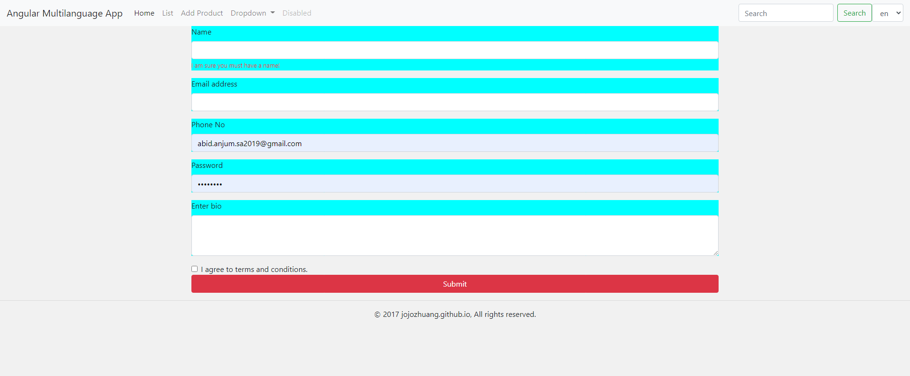

# AngularMultilanguageAdvanceCrudApp
In this Angular 11 Internationalization (i18n) tutorial, we will look at how to create a MultiLingual Angular 11 site using ngx-translate library.

Abid: I also included Arabic language and RTL feature

